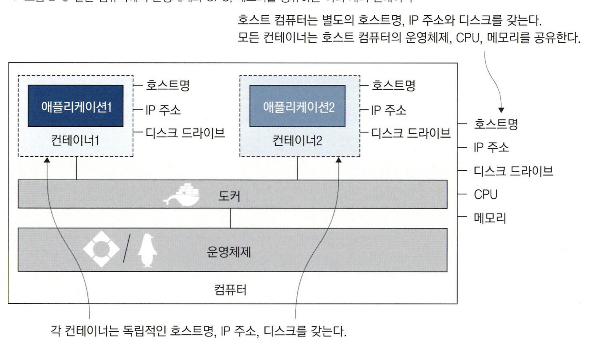
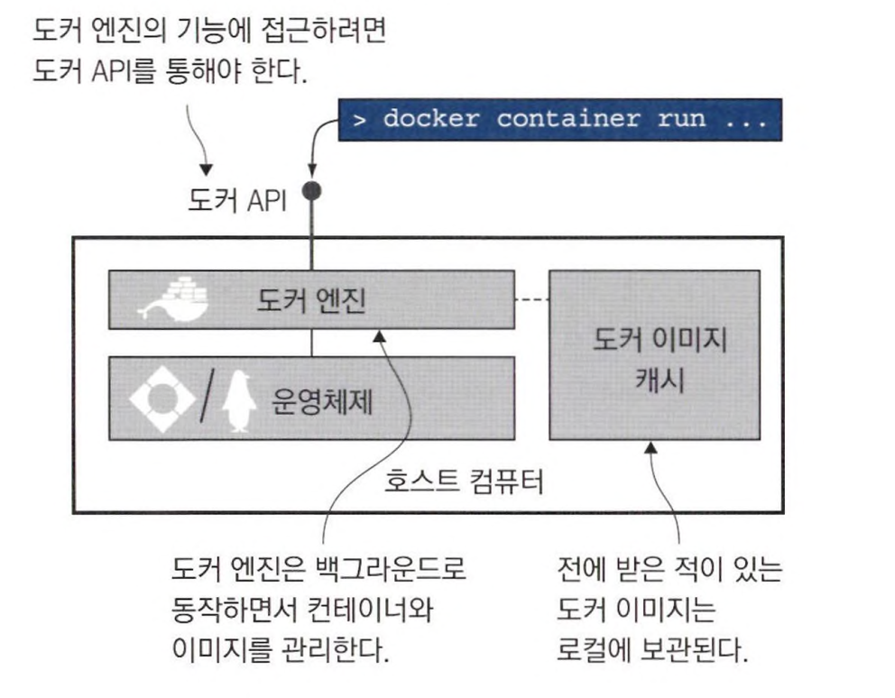

# 2장 도커의 기본적인 사용법

## 2.2 컨테이너란 무엇인가?

컨테이너란 애플리케이션과 그 실행 환경을 하나의 패키지로 묶어 어디서든 일관되게 실행할 수 있는 기술이다.

호스트명 ,IP주소, 파일시스템까지 모두 도커가 만들어낸 가상 리소스다 



컨테이너 밖 호스트는 컨테이너를 볼 순 있지만, 컨테이너는 호스트를 볼 수는 없다.

한 컴퓨터에서 여러 애플리케이션을 실행하기 위해 했던 시도는 가상머신이다.

가상머신은 애플리케이션이 실행될 독립적 환경이 생기지만, 호스트 컴퓨터의 운영체제를 공유하지 않고 별도의 운영체제를 필요로 한다. 각각의 가상머신은 별도의 운영체제를 가지므로 자원을 상당히 차지하며 라이선스 비용과 업데이트 부담이 늘어난다. 가상머신은 격리는 달성할 수 있지만 밀집은 달성하지 못한다

컨테이너는 호스트의 운영체제를 공유하므로 리소스가 경감되며 가상머신에 비해 더 많은 애플리케이션을 실행할 수 있다.

## 2.5 도커가 컨테이너를 실행하는 원리

도커 컨테이너를 실행하는 일은 여러 컴포넌트가 관여한다



* 도커 엔진은 도커 관리 기능을 맡는 컴포넌트. 이미지 캐시, 가상 네트워크, 도커 리소스를 만드는 일도 담당하며, 항시 동작하는 백그라운드 프로세스 
  * 도커 API를 통해 맡은 기능을 수행하며 표준 HTTP 기반 REST API다. 

- **도커 엔진 API 레퍼런스**
  https://docs.docker.com/engine/api/
  도커 엔진 API의 최신 버전 및 이전 버전에 대한 상세한 문서를 제공.
- **도커 SDK 및 API 가이드**
  https://docs.docker.com/develop/sdk/
  다양한 프로그래밍 언어용 도커 SDK와 API 사용 예제를 확인
- **도커 HTTP API 사용 예제**
  https://docs.docker.com/engine/api/sdk/examples/
  도커 API를 활용한 실제 코드 예제

```
컨테이너(Container) 관련 API

GET /containers/json: 실행 중인 컨테이너 목록 조회
POST /containers/create: 새로운 컨테이너 생성
POST /containers/{id}/start: 컨테이너 시작
POST /containers/{id}/stop: 컨테이너 중지
GET /containers/{id}/logs: 컨테이너 로그 확인
DELETE /containers/{id}: 컨테이너 삭제
이미지(Image) 관련 API

GET /images/json: 이미지 목록 조회
POST /images/create: 이미지 가져오기(pull)
POST /build: 이미지 빌드
DELETE /images/{name}: 이미지 삭제
네트워크(Network) 관련 API

GET /networks: 네트워크 목록 조회
POST /networks/create: 새로운 네트워크 생성
POST /networks/{id}/connect: 컨테이너를 네트워크에 연결
POST /networks/{id}/disconnect: 컨테이너를 네트워크에서 분리
DELETE /networks/{id}: 네트워크 삭제
볼륨(Volume) 관련 API

GET /volumes: 볼륨 목록 조회
POST /volumes/create: 새로운 볼륨 생성
DELETE /volumes/{name}: 볼륨 삭제
시스템(System) 관련 API

GET /info: 도커 시스템 정보 확인
GET /version: 도커 버전 정보 확인
GET /events: 도커 이벤트 스트림 수신
Exec 관련 API

POST /containers/{id}/exec: 컨테이너에서 명령 실행 준비
POST /exec/{id}/start: 준비된 명령 실행
POST /exec/{id}/resize: 실행 중인 명령의 터미널 크기 조정
플러그인(Plugin) 관련 API

GET /plugins: 플러그인 목록 조회
POST /plugins/pull: 플러그인 설치
DELETE /plugins/{name}: 플러그인 삭제
시크릿(Secret) 및 컨피그(Config) 관련 API

GET /secrets: 시크릿 목록 조회
POST /secrets/create: 새로운 시크릿 생성
GET /configs: 컨피그 목록 조회
POST /configs/create: 새로운 컨피그 생성
```

호스트와 원격에서 사용할 수 있는 각 도커 REST API의 사용법 예시입니다. 이 예시들은 `curl` 명령을 사용하며, 호스트에서는 UNIX 소켓을, 원격에서는 TCP 소켓을 통해 도커 데몬과 통신합니다.

**참고:** 원격으로 도커 API에 접근할 때는 보안에 유의해야 합니다. 실제 환경에서는 TLS를 사용하여 연결을 보호하는 것이 권장됩니다.

---

### 컨테이너(Container) 관련 API

#### 1. **GET /containers/json**: 실행 중인 컨테이너 목록 조회

- **호스트에서 실행**

  ```bash
  curl --unix-socket /var/run/docker.sock http://localhost/v1.41/containers/json
  ```

- **원격에서 실행**

  ```bash
  curl http://DOCKER_HOST_IP:2375/v1.41/containers/json
  ```

#### 2. **POST /containers/create**: 새로운 컨테이너 생성

- **호스트에서 실행**

  ```bash
  curl --unix-socket /var/run/docker.sock -H "Content-Type: application/json" \
       -d '{"Image": "alpine", "Cmd": ["echo", "Hello, World!"]}' \
       -X POST http://localhost/v1.41/containers/create
  ```

- **원격에서 실행**

  ```bash
  curl -H "Content-Type: application/json" \
       -d '{"Image": "alpine", "Cmd": ["echo", "Hello, World!"]}' \
       -X POST http://DOCKER_HOST_IP:2375/v1.41/containers/create
  ```

#### 3. **POST /containers/{id}/start**: 컨테이너 시작

- **호스트에서 실행**

  ```bash
  CONTAINER_ID=$(curl --unix-socket /var/run/docker.sock -H "Content-Type: application/json" \
                      -d '{"Image": "alpine", "Cmd": ["sleep", "60"]}' \
                      -X POST http://localhost/v1.41/containers/create | jq -r '.Id')
  
  curl --unix-socket /var/run/docker.sock -X POST http://localhost/v1.41/containers/$CONTAINER_ID/start
  ```

- **원격에서 실행**

  ```bash
  CONTAINER_ID=$(curl -H "Content-Type: application/json" \
                      -d '{"Image": "alpine", "Cmd": ["sleep", "60"]}' \
                      -X POST http://DOCKER_HOST_IP:2375/v1.41/containers/create | jq -r '.Id')
  
  curl -X POST http://DOCKER_HOST_IP:2375/v1.41/containers/$CONTAINER_ID/start
  ```

#### 4. **POST /containers/{id}/stop**: 컨테이너 중지

- **호스트에서 실행**

  ```bash
  curl --unix-socket /var/run/docker.sock -X POST http://localhost/v1.41/containers/$CONTAINER_ID/stop
  ```

- **원격에서 실행**

  ```bash
  curl -X POST http://DOCKER_HOST_IP:2375/v1.41/containers/$CONTAINER_ID/stop
  ```

#### 5. **GET /containers/{id}/logs**: 컨테이너 로그 확인

- **호스트에서 실행**

  ```bash
  curl --unix-socket /var/run/docker.sock \
       "http://localhost/v1.41/containers/$CONTAINER_ID/logs?stdout=1&stderr=1"
  ```

- **원격에서 실행**

  ```bash
  curl "http://DOCKER_HOST_IP:2375/v1.41/containers/$CONTAINER_ID/logs?stdout=1&stderr=1"
  ```

#### 6. **DELETE /containers/{id}**: 컨테이너 삭제

- **호스트에서 실행**

  ```bash
  curl --unix-socket /var/run/docker.sock -X DELETE http://localhost/v1.41/containers/$CONTAINER_ID
  ```

- **원격에서 실행**

  ```bash
  curl -X DELETE http://DOCKER_HOST_IP:2375/v1.41/containers/$CONTAINER_ID
  ```

---

### 이미지(Image) 관련 API

#### 1. **GET /images/json**: 이미지 목록 조회

- **호스트에서 실행**

  ```bash
  curl --unix-socket /var/run/docker.sock http://localhost/v1.41/images/json
  ```

- **원격에서 실행**

  ```bash
  curl http://DOCKER_HOST_IP:2375/v1.41/images/json
  ```

#### 2. **POST /images/create**: 이미지 가져오기(pull)

- **호스트에서 실행**

  ```bash
  curl --unix-socket /var/run/docker.sock -X POST \
       "http://localhost/v1.41/images/create?fromImage=alpine&tag=latest"
  ```

- **원격에서 실행**

  ```bash
  curl -X POST "http://DOCKER_HOST_IP:2375/v1.41/images/create?fromImage=alpine&tag=latest"
  ```

#### 3. **POST /build**: 이미지 빌드

- **호스트에서 실행**

  ```bash
  tar -cz . | curl --unix-socket /var/run/docker.sock -H "Content-Type: application/tar" \
       --data-binary @- -X POST "http://localhost/v1.41/build?t=myimage:latest"
  ```

- **원격에서 실행**

  ```bash
  tar -cz . | curl -H "Content-Type: application/tar" --data-binary @- \
       -X POST "http://DOCKER_HOST_IP:2375/v1.41/build?t=myimage:latest"
  ```

#### 4. **DELETE /images/{name}**: 이미지 삭제

- **호스트에서 실행**

  ```bash
  IMAGE_NAME="myimage:latest"
  curl --unix-socket /var/run/docker.sock -X DELETE http://localhost/v1.41/images/$IMAGE_NAME
  ```

- **원격에서 실행**

  ```bash
  IMAGE_NAME="myimage:latest"
  curl -X DELETE http://DOCKER_HOST_IP:2375/v1.41/images/$IMAGE_NAME
  ```

---

### 네트워크(Network) 관련 API

#### 1. **GET /networks**: 네트워크 목록 조회

- **호스트에서 실행**

  ```bash
  curl --unix-socket /var/run/docker.sock http://localhost/v1.41/networks
  ```

- **원격에서 실행**

  ```bash
  curl http://DOCKER_HOST_IP:2375/v1.41/networks
  ```

#### 2. **POST /networks/create**: 새로운 네트워크 생성

- **호스트에서 실행**

  ```bash
  curl --unix-socket /var/run/docker.sock -H "Content-Type: application/json" \
       -d '{"Name": "mynetwork", "Driver": "bridge"}' \
       -X POST http://localhost/v1.41/networks/create
  ```

- **원격에서 실행**

  ```bash
  curl -H "Content-Type: application/json" \
       -d '{"Name": "mynetwork", "Driver": "bridge"}' \
       -X POST http://DOCKER_HOST_IP:2375/v1.41/networks/create
  ```

#### 3. **POST /networks/{id}/connect**: 컨테이너를 네트워크에 연결

- **호스트에서 실행**

  ```bash
  NETWORK_ID="mynetwork"
  curl --unix-socket /var/run/docker.sock -H "Content-Type: application/json" \
       -d "{\"Container\": \"$CONTAINER_ID\"}" \
       -X POST http://localhost/v1.41/networks/$NETWORK_ID/connect
  ```

- **원격에서 실행**

  ```bash
  NETWORK_ID="mynetwork"
  curl -H "Content-Type: application/json" \
       -d "{\"Container\": \"$CONTAINER_ID\"}" \
       -X POST http://DOCKER_HOST_IP:2375/v1.41/networks/$NETWORK_ID/connect
  ```

#### 4. **POST /networks/{id}/disconnect**: 컨테이너를 네트워크에서 분리

- **호스트에서 실행**

  ```bash
  NETWORK_ID="mynetwork"
  curl --unix-socket /var/run/docker.sock -H "Content-Type: application/json" \
       -d "{\"Container\": \"$CONTAINER_ID\"}" \
       -X POST http://localhost/v1.41/networks/$NETWORK_ID/disconnect
  ```

- **원격에서 실행**

  ```bash
  NETWORK_ID="mynetwork"
  curl -H "Content-Type: application/json" \
       -d "{\"Container\": \"$CONTAINER_ID\"}" \
       -X POST http://DOCKER_HOST_IP:2375/v1.41/networks/$NETWORK_ID/disconnect
  ```

#### 5. **DELETE /networks/{id}**: 네트워크 삭제

- **호스트에서 실행**

  ```bash
  NETWORK_ID="mynetwork"
  curl --unix-socket /var/run/docker.sock -X DELETE http://localhost/v1.41/networks/$NETWORK_ID
  ```

- **원격에서 실행**

  ```bash
  NETWORK_ID="mynetwork"
  curl -X DELETE http://DOCKER_HOST_IP:2375/v1.41/networks/$NETWORK_ID
  ```

---

### 볼륨(Volume) 관련 API

#### 1. **GET /volumes**: 볼륨 목록 조회

- **호스트에서 실행**

  ```bash
  curl --unix-socket /var/run/docker.sock http://localhost/v1.41/volumes
  ```

- **원격에서 실행**

  ```bash
  curl http://DOCKER_HOST_IP:2375/v1.41/volumes
  ```

#### 2. **POST /volumes/create**: 새로운 볼륨 생성

- **호스트에서 실행**

  ```bash
  curl --unix-socket /var/run/docker.sock -H "Content-Type: application/json" \
       -d '{"Name": "myvolume"}' \
       -X POST http://localhost/v1.41/volumes/create
  ```

- **원격에서 실행**

  ```bash
  curl -H "Content-Type: application/json" \
       -d '{"Name": "myvolume"}' \
       -X POST http://DOCKER_HOST_IP:2375/v1.41/volumes/create
  ```

#### 3. **DELETE /volumes/{name}**: 볼륨 삭제

- **호스트에서 실행**

  ```bash
  VOLUME_NAME="myvolume"
  curl --unix-socket /var/run/docker.sock -X DELETE http://localhost/v1.41/volumes/$VOLUME_NAME
  ```

- **원격에서 실행**

  ```bash
  VOLUME_NAME="myvolume"
  curl -X DELETE http://DOCKER_HOST_IP:2375/v1.41/volumes/$VOLUME_NAME
  ```

---

### 시스템(System) 관련 API

#### 1. **GET /info**: 도커 시스템 정보 확인

- **호스트에서 실행**

  ```bash
  curl --unix-socket /var/run/docker.sock http://localhost/v1.41/info
  ```

- **원격에서 실행**

  ```bash
  curl http://DOCKER_HOST_IP:2375/v1.41/info
  ```

#### 2. **GET /version**: 도커 버전 정보 확인

- **호스트에서 실행**

  ```bash
  curl --unix-socket /var/run/docker.sock http://localhost/v1.41/version
  ```

- **원격에서 실행**

  ```bash
  curl http://DOCKER_HOST_IP:2375/v1.41/version
  ```

#### 3. **GET /events**: 도커 이벤트 스트림 수신

- **호스트에서 실행**

  ```bash
  curl --unix-socket /var/run/docker.sock http://localhost/v1.41/events
  ```

- **원격에서 실행**

  ```bash
  curl http://DOCKER_HOST_IP:2375/v1.41/events
  ```

---

### Exec 관련 API

#### 1. **POST /containers/{id}/exec**: 컨테이너에서 명령 실행 준비

- **호스트에서 실행**

  ```bash
  EXEC_ID=$(curl --unix-socket /var/run/docker.sock -H "Content-Type: application/json" \
                 -d '{"Cmd": ["ls", "/"], "AttachStdout": true, "AttachStderr": true}' \
                 -X POST http://localhost/v1.41/containers/$CONTAINER_ID/exec | jq -r '.Id')
  ```

- **원격에서 실행**

  ```bash
  EXEC_ID=$(curl -H "Content-Type: application/json" \
                 -d '{"Cmd": ["ls", "/"], "AttachStdout": true, "AttachStderr": true}' \
                 -X POST http://DOCKER_HOST_IP:2375/v1.41/containers/$CONTAINER_ID/exec | jq -r '.Id')
  ```

#### 2. **POST /exec/{id}/start**: 준비된 명령 실행

- **호스트에서 실행**

  ```bash
  curl --unix-socket /var/run/docker.sock -H "Content-Type: application/json" \
       -d '{"Detach": false, "Tty": false}' \
       -X POST http://localhost/v1.41/exec/$EXEC_ID/start
  ```

- **원격에서 실행**

  ```bash
  curl -H "Content-Type: application/json" \
       -d '{"Detach": false, "Tty": false}' \
       -X POST http://DOCKER_HOST_IP:2375/v1.41/exec/$EXEC_ID/start
  ```

#### 3. **POST /exec/{id}/resize**: 실행 중인 명령의 터미널 크기 조정

- **호스트에서 실행**

  ```bash
  curl --unix-socket /var/run/docker.sock -X POST \
       "http://localhost/v1.41/exec/$EXEC_ID/resize?h=40&w=80"
  ```

- **원격에서 실행**

  ```bash
  curl -X POST "http://DOCKER_HOST_IP:2375/v1.41/exec/$EXEC_ID/resize?h=40&w=80"
  ```

---

### 플러그인(Plugin) 관련 API

#### 1. **GET /plugins**: 플러그인 목록 조회

- **호스트에서 실행**

  ```bash
  curl --unix-socket /var/run/docker.sock http://localhost/v1.41/plugins
  ```

- **원격에서 실행**

  ```bash
  curl http://DOCKER_HOST_IP:2375/v1.41/plugins
  ```

#### 2. **POST /plugins/pull**: 플러그인 설치

- **호스트에서 실행**

  ```bash
  curl --unix-socket /var/run/docker.sock -X POST \
       "http://localhost/v1.41/plugins/pull?remote=plugin_name"
  ```

- **원격에서 실행**

  ```bash
  curl -X POST "http://DOCKER_HOST_IP:2375/v1.41/plugins/pull?remote=plugin_name"
  ```

#### 3. **DELETE /plugins/{name}**: 플러그인 삭제

- **호스트에서 실행**

  ```bash
  PLUGIN_NAME="plugin_name"
  curl --unix-socket /var/run/docker.sock -X DELETE http://localhost/v1.41/plugins/$PLUGIN_NAME
  ```

- **원격에서 실행**

  ```bash
  PLUGIN_NAME="plugin_name"
  curl -X DELETE http://DOCKER_HOST_IP:2375/v1.41/plugins/$PLUGIN_NAME
  ```

---

### 시크릿(Secret) 및 컨피그(Config) 관련 API

**주의:** 시크릿과 컨피그는 Docker Swarm 모드에서 사용됩니다.

#### 1. **GET /secrets**: 시크릿 목록 조회

- **호스트에서 실행**

  ```bash
  curl --unix-socket /var/run/docker.sock http://localhost/v1.41/secrets
  ```

- **원격에서 실행**

  ```bash
  curl http://DOCKER_HOST_IP:2375/v1.41/secrets
  ```

#### 2. **POST /secrets/create**: 새로운 시크릿 생성

- **호스트에서 실행**

  ```bash
  curl --unix-socket /var/run/docker.sock -H "Content-Type: application/json" \
       -d '{"Name": "mysecret", "Data": "'$(echo -n "secret_data" | base64)'"}' \
       -X POST http://localhost/v1.41/secrets/create
  ```

- **원격에서 실행**

  ```bash
  curl -H "Content-Type: application/json" \
       -d '{"Name": "mysecret", "Data": "'$(echo -n "secret_data" | base64)'"}' \
       -X POST http://DOCKER_HOST_IP:2375/v1.41/secrets/create
  ```

#### 3. **GET /configs**: 컨피그 목록 조회

- **호스트에서 실행**

  ```bash
  curl --unix-socket /var/run/docker.sock http://localhost/v1.41/configs
  ```

- **원격에서 실행**

  ```bash
  curl http://DOCKER_HOST_IP:2375/v1.41/configs
  ```

#### 4. **POST /configs/create**: 새로운 컨피그 생성

- **호스트에서 실행**

  ```bash
  curl --unix-socket /var/run/docker.sock -H "Content-Type: application/json" \
       -d '{"Name": "myconfig", "Data": "'$(echo -n "config_data" | base64)'"}' \
       -X POST http://localhost/v1.41/configs/create
  ```

- **원격에서 실행**

  ```bash
  curl -H "Content-Type: application/json" \
       -d '{"Name": "myconfig", "Data": "'$(echo -n "config_data" | base64)'"}' \
       -X POST http://DOCKER_HOST_IP:2375/v1.41/configs/create
  ```

---

**추가 참고사항:**

- **API 버전 조정:** 예시에서는 도커 엔진 API 버전 `v1.41`을 사용. 도커 엔진 버전에 따라 API 버전이 다를 수 있으니, 자신의 도커 버전에 맞게 조정이 필요.

- **`jq` 유틸리티 사용:** 일부 예제에서는 JSON 응답을 처리하기 위해 `jq`를 사용하였습니다. 설치되어 있지 않다면 다음 명령어로 설치할 수 있습니다.

  ```bash
  # Debian/Ubuntu
  sudo apt-get install jq
  
  # CentOS/RHEL
  sudo yum install jq
  ```

- **환경 변수 설정:** 예시에서 사용된 `$CONTAINER_ID`, `$IMAGE_NAME`, `$NETWORK_ID`, `$VOLUME_NAME`, `$EXEC_ID`, `$PLUGIN_NAME` 등은 실제 값으로 대체되어야 합니다.

- **보안 고려:** 원격으로 도커 API에 접근할 때는 반드시 TLS 설정 등을 통해 연결을 안전하게 보호해야 합니다. 그렇지 않으면 도커 데몬이 외부에 노출되어 보안 위험이 발생할 수 있습니다.

- **도커 데몬 설정:** 원격 접근을 위해 도커 데몬이 TCP 소켓을 수신하도록 설정되어 있어야 합니다. `/etc/docker/daemon.json` 파일에 다음과 같이 설정할 수 있습니다.

  ```json
  {
    "hosts": ["unix:///var/run/docker.sock", "tcp://0.0.0.0:2375"]
  }
  ```

  **주의:** 실제 운영 환경에서는 TLS 없이 TCP 포트를 열어두는 것은 매우 위험합니다. 반드시 TLS를 사용하여 인증 및 암호화를 적용해야 합니다.