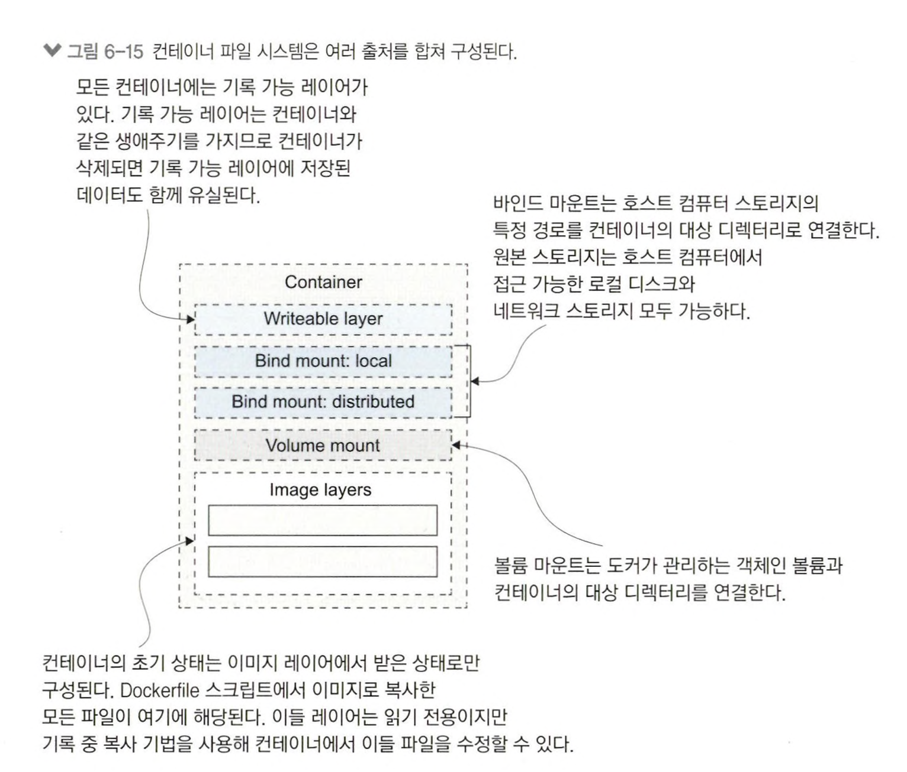

# 6장 도커 볼륨을 이용한 퍼시스턴트 스토리지

컨테이너는 무상태 애플리케이션의 최적의 실행 환경이다. 이로 인해 확장성이 높아지고, 여러 개의 컨테이너 인스턴스를 생성하거나 삭제하더라도 문제가 생기지 않는다. 

그러나 어쩔수없이 파일시스템과 디스크 공간이 필요하긴 하다. 예를 들면, 애플리케이션에서 생성한 로그 파일을 저장하거나, 업로드된 파일을 처리할 때, 또는 애플리케이션이 일시적인 캐시 데이터를 보관할 때 디스크 공간이 필요하다.

## 6.1 컨테이너 속 데이터가 사라지는 이유

도커 컨테이너도 단일 드라이브로 된 파일 시스템이 있다. COPY 인스트럭션을 사용해 파일을 이미지로 복사하면 컨테이너 내부에 지정된 경로에 파일이 있다.

도커 이미지는 여러 레이어 형태로 저장되는데, 컨테이너 디스크 역시 이 이미지 레이어를 순서대로 합쳐 만든 가상 파일 시스템이다.

컨테이너가 종료되도 파일 시스템은 삭제되지 않는다.

cp 명령어로 컨테이너 내의 파일을 로컬 컴퓨터로, 혹은 컨테이너 내부로 파일을 복사할 수 있따.

```docker
## 컨테이너 to 로컬
docker cp <컨테이너 ID 또는 이름>:<컨테이너 내 파일 경로> <로컬 경로>

## 로컬 to 컨테이너
docker cp <로컬 파일 경로> <컨테이너 ID 또는 이름>:<컨테이너 내 경로>
```

컨테이너 내 파일 시스템은 단일 디스크(리눅스는 /dev/sda1, 윈도우는 C:\)다.

각 컨테이너가 공유하는 이미지 레이어는 읽기 전용이고, 쓰기 가능 레이어는 컨테이너를 실행될 때 생성되며 삭제할때 함께 삭제된다(그래서 종료하는 것만으로는 컨테이너가 삭제되지 않고, 데이터도 그대로 남아있다. )

컨테이너 속 파일을 수정하면 이미지를 공유하는 다른 컨테이너나 이미지에는 영향을 받지 않는다. 수정된 파일은 해당 컨테이너만의 기록 가능 레이어에서만 존재하기 때문. 그리고 컨테이너가 삭제되면 이 컨테이너의 기록 가능 레이어와 수정된 데이터도 함께 삭제된다. 

만약 데이터베이스 컨테이너라고 하면 지옥이라고 말할 수 있다. 도커는 이런 상황도 감안해 도커 볼륨과 마운트라는 요소로 영속 데이터를 저장할 수 있다. 

## 6.2 도커 볼륨을 사용하는 컨테이너 실행하기

도커 볼륨은 도커에서 스토리지를 다루는 단위다. 컨테이너와 독립적으로 존재하며 별도의 생애주기를 갖지만 컨테이너와 연결할 수 있다. 볼륨을 생성해 애플리케이션 컨테이너에 연결하면 컨테이너 파일 시스템의 한 디렉터리가 된다.

애플리케이션을 업데이트 하더라도 새 컨테이너에 다시 볼륨을 연결하면 데이터가 유지된다.

컨테이너에서 볼륨을 사용하는 방법은 2가지다.

1. 수동으로 직접 볼륨 생성해 연결
2. Dockerfile 스크립트에서 VOLUME 인스트럭션 사용

```dockerfile
FROM diamol/dotnet-aspnet
WORKDIR /app
ENTRYPOINT ["dotnet", "ToDoList.dll"]

VOLUME /data
COPY --from=builder /out/ .
```

컨테이너 실행시 /data 티렉터리가 있고, 해당 디렉터리 내용은 볼륨에 영구적으로 저장된다 

docker volume 명령을 사용해 목록을 확인할 수 있다

```
docker volume ls 

# docker volume prune -f < 사용하지 않는 볼륨 목록 제거 
```

도커 이미지에서 볼륨을 정의하면 컨테이너를 생성할 때마다 새로운 볼륨을 만든다.

같은 볼륨을 공유하게 할 수도 있다. volumes-from 플래그 적용시 다른 컨테이너의 볼륨을 연결할 수 있다. 

볼륨은 컨테이너가 삭제되더라도 그대로 남아있다. 즉 생명주기를 다르게 가진다. 

```
docker run -d -p 8011:80 -v 볼륨위치:/볼륨명 --name appName 이미지/태그명
```


또한 주의할점은. VOLUME 인스터럭션을 사용해 도커파일에서 빌드된 이미지로, docker run 명령어에서 볼륨을 지정하지 않으면 항상 새로운 볼륨을 함께 생성하며 무작위로 만들어진 식별자를 가지므로 이 식별자를 미리 기억하지 않으면 재사용할 수 없다. 

## 6.3 파일 시스템 마운트를 사용하는 컨테이너 실행하기

볼륨의 장점은 컨테이너와 스토리지의 생애주기를 분리하면서 도커 사용하는 방식 그대로 스토리지를 다를 수 있다.

볼륨 역시 호스트 컴퓨터에 존재하지만 컨테이너와는 분리돼있다. 호스트의 스토리지를 컨테이너에 직접적으로 연결할 수 있는 수단은 바로 바인드 마운트다. 바인드 마운트는 호스트 컴퓨터 파일 시스템의 디렉터리를 컨테이너 파일 시스템의 디렉터리로 만든다. 즉 호스트 컴퓨터의 파일에 직접 접근할 수 있다.

SSD, 디스크 어레이, NFS 분산 스토리지 등 호스트 컴에서 접근가능한 파일 시스템이라면 무엇이든 컨테이너에서 사용할 수 있다. 만약 RAID가 적용된 디스크 어레이를 가진 서버가 있다면 디비 스토리지로도 쓸 수 있다.

* RAID(Redundant Array of Independent Disks)는 여러 개의 디스크를 결합하여 하나의 디스크처럼 사용하는 기술.  RAID가 적용된 디스크 어레이는 여러 하드디스크를 하나의 논리적 단위로 묶어 운영함으로써, 데이터 중복 저장과 병렬 처리를 통해 성능과 안정성을 높이는 시스템이다. 

명령어

```
# v옵션 사용법
## 호스트의 /Users/ysk/business/data 디렉토리를 컨테이너의 /app/data 디렉토리에 마운트하려면:

docker run -v /Users/ysk/business/data:/app/data [이미지 이름]

# --mount는 더 세부적인 설정이 가능
docker run --mount type=bind,source=[호스트 디렉토리],target=[컨테이너 디렉토리] [이미지 이름]

docker run --mount type=bind,source=/Users/ysk/business/data,target=/app/data [이미지 이름]

```

* *type=bind**: 호스트의 디렉토리를 컨테이너에 바인드 마운트할 것을 지정

* **source**: 호스트의 디렉토리 경로를 지정

* **target**: 컨테이너 내부의 디렉토리 경로를 지정

파일을 읽기 전용으로 마운트하려면 `:ro` 또는 `readonly` 옵션을 추가

```
docker run -v /Users/ysk/business/data:/app/data:ro [이미지 이름]
```

바인드 마운트는 양방향으로 동작하여 컨테이너에서도 호스트에서도 수정이 가능하며 바뀐게 바로 적용된다

호스트 컴퓨터에 대한 공격 방어로 컨테이너는 파일 읽기 또는 수정 권한이 없다면 Dockerfile에서 권한을 부여할 수 있다.

```dockerfile
# 베이스 이미지 설정
FROM ubuntu:latest

# 관리자 권한이 필요한 패키지 설치 단계
USER root
RUN apt-get update && apt-get install -y sudo curl

# 컨테이너 내부에 새로운 사용자 생성
RUN useradd -m myuser && echo "myuser:mypassword" | chpasswd && adduser myuser sudo

# 특정 작업을 myuser로 실행하기 위해 사용자 변경
USER myuser

# 사용자 권한을 이용해 작업 수행
CMD ["echo", "Hello from myuser!"]
```

### NFS

*NFS(Network File System)**는 네트워크를 통해 다른 서버의 파일 시스템을 공유하는 프로토콜로  이를 통해 클라이언트 시스템이 원격 파일 시스템을 로컬처럼 사용할 수 있게한다. 

 주로 Unix와 Linux 환경에서 사용되며, 원격 파일 시스템을 마운트하여 데이터를 공유하는 데 유용하다.

Docker에서는 NFS를 사용하여 외부 스토리지나 다른 서버의 파일 시스템을 컨테이너에 볼륨으로 마운트하여 여러 컨테이너가 동일한 파일 시스템을 공유할 수 있다.

### NFS란?

**NFS(Network File System)**는 네트워크를 통해 다른 서버의 파일 시스템을 공유하는 프로토콜입니다. 이를 통해 클라이언트 시스템이 원격 파일 시스템을 로컬처럼 사용할 수 있게 해줍니다. 주로 Unix와 Linux 환경에서 사용되며, 원격 파일 시스템을 마운트하여 데이터를 공유하는 데 유용합니다.

#### NFS 볼륨을 Docker에 마운트하기

1. **NFS 서버 설정**: 먼저 NFS 서버가 설치되어 있어야 하며, 공유할 디렉터리를 설정해야 한다.

   예를 들어, `/etc/exports` 파일에 다음과 같이 공유할 디렉터리를 설정한다.

   ```bash
   /path/to/shared/folder *(rw,sync,no_subtree_check)
   ```

2. **클라이언트에서 NFS 공유 마운트 확인**: 클라이언트에서 다음 명령어로 NFS가 설치되어 있는지 확인한다.

   ```bash
   sudo apt-get install nfs-common
   ```

3. **Docker에서 NFS 볼륨 생성**: Docker에서 외부 NFS 볼륨을 생성하고 마운트하려면, `docker run` 명령어에 `--mount` 옵션을 사용하거나 `docker-compose` 파일에서 설정할 수 있다.

   - **docker run 명령어 사용**:

     ```bash
     # SSH 터널 생성 (서버와의 통신을 로컬 포트로 포워딩)
     ssh -L 2049:<NFS_SERVER_IP>:2049 -N -f user@<NFS_SERVER_IP>
     
     # Docker 명령어 실행
     docker run -d \
       --name my-container \
       --mount type=volume,source=nfs-volume,target=/mnt/shared \
       --volume-driver local \
       --opt type=nfs \
       --opt o=addr=localhost,port=2049,rw \
       --opt device=:/path/to/shared/folder \
       my-image
     
     ```

   - **docker-compose 파일 설정**:

     ```yaml
     version: '3.8'
     
     services:
       my-service:
         image: my-image
         volumes:
           - nfs-volume:/mnt/shared
     
     volumes:
       nfs-volume:
         driver: local
         driver_opts:
           type: "nfs"
           o: "addr=localhost,port=2049,rw"
           device: ":/path/to/shared/folder"
     ```

### 리모트 DB 서버를 여러 컨테이너에서 사용하는 방법

1. **리모트 DB 서버 준비**: 데이터베이스 서버가 리모트 환경에 있고, 컨테이너들이 접근할 수 있도록 네트워크 설정이 필요하다.. 일반적으로 데이터베이스 서버의 포트(예: MySQL의 경우 3306, PostgreSQL의 경우 5432)를 열어야 하며, 방화벽과 보안 그룹 설정을 통해 컨테이너에서 접근할 수 있는지 확인해야한다.

2. **컨테이너에서 리모트 DB 연결**:

   - **환경 변수 사용**: Docker Compose 파일이나 `docker run` 명령어에서 데이터베이스의 IP 주소와 포트를 환경 변수로 설정해 접근할 수 있다.

   - **예시 (docker-compose.yaml)**:

     ```yaml
     version: '3.8'
     
     services:
       my-app:
         image: my-app-image
         volumes:
           - /path/to/private_key:/root/.ssh/id_rsa:ro    # SSH 키 파일을 읽기 전용으로 마운트
         environment:
           DB_HOST: "<DB_SERVER_IP>"
           DB_PORT: "3306"
           DB_USER: "your_db_user"
           DB_PASSWORD: "your_db_password"
           SSH_KEY_PATH: "/root/.ssh/id_rsa"              # SSH 키 파일 경로 설정
           SSH_USER: "ssh_user"                           # SSH 사용자 설정
           DB_NAME: "your_database_name"                  # 데이터베이스 이름 설정
     
     ```

   - **예시 (docker run 명령어)**:

     ```bash
     docker run -d \
       --name my-app-container \
       -v /path/to/private_key:/root/.ssh/id_rsa:ro \    # SSH 키 파일을 읽기 전용으로 마운트
       -e DB_HOST=<DB_SERVER_IP> \
       -e DB_PORT=3306 \
       -e DB_USER="your_db_user" \
       -e DB_PASSWORD="your_db_password" \
       -e SSH_KEY_PATH="/root/.ssh/id_rsa" \              # SSH 키 파일 경로 설정
       -e SSH_USER="ssh_user" \                           # SSH 사용자 설정
       -e DB_NAME="your_database_name" \                  # 데이터베이스 이름 설정
       my-app-image
     
     ```

이 방식으로 여러 컨테이너에서 동일한 원격 DB 서버에 접근할 수 있지만 성능 최적화와 네트워크 지연을 고려해야 한다.

또다른 방법으론  **Docker 네트워크** 기능을 사용하거나, **VPN 및 프록시 설정**을 통해 여러 컨테이너에서 안전하고 효율적으로 외부 리모트 스토리지 또는 DB에 접근할 수 있다. 

### 1. Docker 네트워크 오버레이 사용

Docker Swarm이나 Kubernetes 같은 오케스트레이션 도구를 사용하면, 클러스터 내 여러 노드와 컨테이너가 서로 네트워크를 통해 쉽게 통신할 수 있다. . Docker Swarm에서는 **오버레이 네트워크(Overlay Network)**를 생성해 여러 컨테이너가 하나의 네트워크를 공유하도록 할 수 있다.

#### Docker 오버레이 네트워크 설정

1. Docker Swarm을 시작

   ```bash
   docker swarm init
   ```

2. 오버레이 네트워크를 생성

   ```bash
   docker network create -d overlay --attachable my-overlay-network
   ```

3. 컨테이너를 오버레이 네트워크에 연결하여 실행

   ```bash
   docker run -d --name app-container --network my-overlay-network my-app-image
   docker run -d --name db-container --network my-overlay-network my-db-image
   ```

이렇게 하면 `app-container`와 `db-container`가 같은 네트워크를 공유하므로, 서로 간에 DNS를 통해 이름으로 접근할 수 있다. 이를 통해 DB 서버가 외부에 있더라도 컨테이너에서 쉽게 접근할 수 있다.

### 2. VPN을 통한 네트워크 연결

외부 리모트 서버와 Docker 컨테이너 간의 안전한 통신이 필요한 경우, VPN을 사용해 네트워크를 구성할 수 있다.

#### VPN을 통한 설정 방법

1. 외부 DB 서버와 동일한 네트워크에 있는 VPN 서버를 설정

2. Docker 컨테이너 내에서 VPN 클라이언트를 설치하고, VPN을 통해 DB 서버와 연결

   예를 들어, OpenVPN을 사용해 Docker 컨테이너와 외부 리모트 DB 서버 간의 안전한 연결을 구축

   ```bash
   docker run -d --cap-add=NET_ADMIN --device /dev/net/tun \
     -v /path/to/openvpn/config.ovpn:/etc/openvpn/config.ovpn \
     --name vpn-container my-openvpn-image
   ```

3. 컨테이너에서 VPN 네트워크를 통해 DB 서버에 접근할 수 있도록 환경 변수나 네트워크 설정을 조정합니다.

### 3. SSH 터널링을 통한 데이터베이스 연결

DB 서버가 방화벽으로 보호되거나 외부에서 직접 접근할 수 없을 때는 SSH 터널링을 사용하여 연결할 수 있다. SSH 터널링을 통해 로컬에서 외부 리모트 DB 서버로 안전한 포트 포워딩을 설정할 수 있다.

## 6.4 파일 시스템 마운트의 한계점

바인드 마운트와 볼륨을 효율적으로 활용하려면 핵심 사용 시나리오와 한계쩜을 이해해야 한다.


시나리오 1. 컨테이너의 마운트 대상 디렉터리가 이미 존재하고, 이미지 레이어에 이디렉터리의 파일이 포함돼 있다면? 

이미 존재하는 대상 디렉터리에 마운트하면 마운트의 원본 디렉터리가 기존 디렉터리를 완전히 대체하여 이미지에 포함돼 있던 파일은 사용할 수 없다.


시나리오 2. 호스트 컴퓨터의 파일 하나를 컨테이너에 존재하는 디렉터리로 마운트 하면?

디렉터리의 파일이 합쳐져 이미지에서 온 파일과 호스트에서 마운트 된 파일이 모두 나타난다 (윈도 컨테이너는 제공 x)


파일 시스템은 윈도와 리눅스 의 시스템이 다르기 때문에 컨테이너의 동작이 일치하지 않는 몇 안되는 영역 중 하나다. 

> 윈도 컨테이너는 단일 파일 마운트 기능을 지원하지 않아서 디렉터리만 마운트 가능하다. 

시나리오3. 분산 파일 시스템을 컨테이너에 바운드 마인트 하면 어떻게 될까.

네트워크 상의 모든 컴퓨터에서 데이터에 접근할 수 있지만, 윈도 파일 공유 용 SMB, AWs s3등 로컬 컴퓨터 운영체제와 파일 시스템이 달라 지원하지 않는 동작이 발생할 수 있다. 


다시한번 정리.

### 1. 볼륨 마운트 (Volumes)

**볼륨 마운트**는 Docker가 관리하는 스토리지 공간을 사용하여 데이터를 저장하는 방법으로, Docker가 직접 관리하므로 호스트의 파일 시스템에 직접 연결되지 않으며, Docker의 볼륨 드라이버를 통해 데이터를 저장하고 관리한다.

#### 특징

- **관리 용이성**: Docker에서 직접 관리하므로, Docker 명령어를 통해 생성, 제거, 백업, 복원 등을 쉽게 할 수 있다.
- **호스트 독립성**: 호스트 시스템의 특정 파일 경로에 종속되지 않습니다. 데이터는 Docker가 지정한 경로에 저장되며, 여러 운영 체제에서 동일한 방식으로 사용된다.
- **보안성**: Docker가 관리하는 경로에 저장되기 때문에 컨테이너와 호스트 간의 경로 충돌이나 권한 문제가 상대적으로 적다.
- **성능 최적화**: Docker가 볼륨을 최적화하여 성능과 안정성을 제공한다. 특히 `local` 드라이버 외에도 `nfs`, `ceph`, `glusterfs` 등 다양한 외부 스토리지 드라이버와 연동이 가능하다.

### 2. 바인드 마운트 (Bind Mounts)

**바인드 마운트**는 호스트 시스템의 특정 디렉터리를 컨테이너 내부의 특정 경로에 연결하는 방법으로, 바인드 마운트를 사용하면 호스트 시스템에 있는 파일과 디렉터리를 컨테이너에서 직접 참조할 수 있다.

#### 특징

- **호스트 의존성**: 호스트 파일 시스템의 경로를 직접 사용하므로, 지정된 경로가 존재해야 하고, 운영 체제에 따라 경로가 다를 수 있다.
- **유연성**: 컨테이너가 실행될 때마다 바인드 마운트를 사용하여 다른 호스트 디렉터리를 컨테이너에 마운트할 수 있습니다. 개발 환경에서 컨테이너가 호스트 파일을 실시간으로 참조해야 할 때 유용하다.
- **권한 관리**: 호스트 파일과 직접 연결되어 있으므로 권한 문제가 발생할 수 있다. 예를 들어, 호스트에서 생성한 파일이 컨테이너의 사용자 권한과 다를 수 있다.
- **성능**: 볼륨보다 성능이 떨어질 수 있으며, 특히 네트워크 파일 시스템이나 분산 파일 시스템을 바인드 마운트하면 성능이 저하될 가능성이 있다.


## 6.5 컨테이너의 파일 시스템은 어떻게 만들어지는가?

모든 컨테이너는 도커가 다양한 출처로부터 모아 만든 단일 가상 디스크로 구성된 파일 시스템을 갖는다.

이 파일 시스템을 union file system 이라고 한다. 이 시스템은 우영체제마다 다른 방식으로 구현되어 있고, 도커가 알아서 우리가 사용하는 운영체제에 맞춰 구현을 선택해주기 때문에 상세한 구현에 대해서는 신경쓸 필요가 없다. 


여러 개의 이미지 레이어를 쌓아 올리는 도커 시스템에서, 하나 이상의 볼륨 마운트와 바인드 마운트를 컨테이너에 연결할 수 있다.

그러나 기록 가능 레이어(쓰기 레이어)는 하나박에 가질 수 없다. 

그러므로 컨테이너 스토리지 구성시 다음을 고려해야 한다

* 기록 가능 레이어(쓰기 레이어): 비용이 비싼 계싼이나 네트워크를 통해 저장해야 하는 데이터의 캐싱등 단기 저장에 적합하다. 각 컨테이너마다 독립적인 기록 가능 레이어를 갖지만 컨테이너가 삭제되면 여기 저장된 데이터는 유실된다. 
* 로컬 바인드 마운트 : 호스트 <-> 컨테이너간 데이터 공유시 사용한다. 소스코드 전달시 사용하면 이미지 빌드 없이 즉시 전달 가능
* 분산 바인드 마운트 : 네트워크 스토리지와 컨테이너간데이터 공유시 사용. 가용성이 높지만 지원하지 않는 파일시스템기능이 있거나 성능면에서 차이가 있을 수 있다. 공유 캐시로 활용할 수 있다.
* 볼륨 마운트 : 컨테이너와 도커 객체인 볼륨간 데이터 공유시 사용한다. 
* 이미지 레이어: 초기 파일 시스템 구성시 사용한다. 읽기 전용이며 여러 컨테이너가 공유한다. 




## 6.6 연습 문제

todo-애플리케이션을 컨테이너로 실행하되 미리 등록된 할 일이 없는 상태로 실행되도록 스토리지 설정

- docker rm-f S(docker ps-aq) 명령으로 먼저 모든 컨테이너를 삭제하라.
- diamol/ch06-lab 이미지로 컨테이너를 실행해 현재 등록된 할 일을 확인하라.
- 이때 마운트를 추가해 컨테이너를 실행해야 한다.
- to-do 애플리케이션의 설정 파일은 앞에서 본 로그 설정보다 좀 더 복잡하다.

